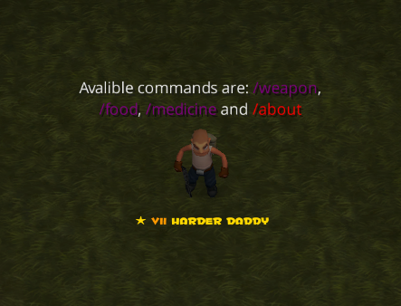
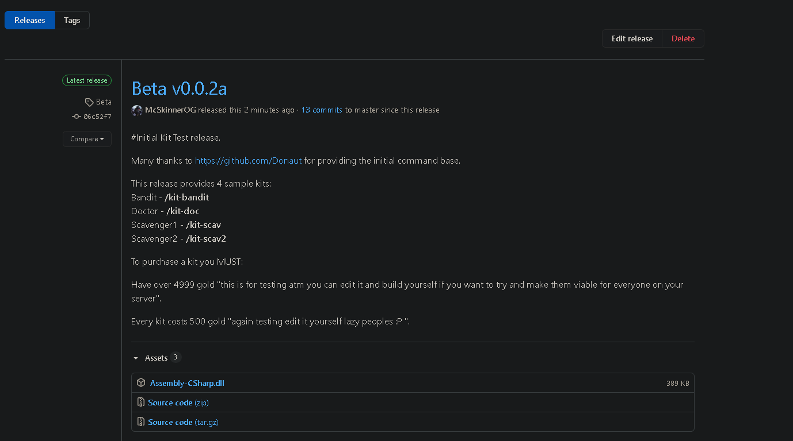
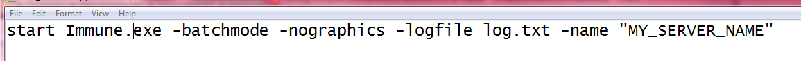

# I.C.E "Immune Command Essentials"
 "Previously Com-Mod/ImmuneCommandMod"
 An Immune Server Mod that add custom commands to the game.
 
 

## Getting Started
1. You need to create a default server. [Guide](https://steamcommunity.com/sharedfiles/filedetails/?id=445315496)
2. Download the precompiled mod binaries. [Download](https://github.com/McSkinnerOG/ImmuneCommandMod/releases)

3. Open the folder where your game was installed and navigate to the <b>Imune_Data\Managed</b> subfolder and just copy the downloaded file there.
4. Succes.

## <b>PRO TIPS:</b>
Copy the original game files to a new folder. This way we don't need to reinstall the game if we want to switch back to the vanilla game.

You can modify your .bat file to get your server listed in the Game server menus.

## Contributing
A proper plugin system needs to be created so we can create mods in an easier way.

## Creator
Donaut ~ Original CommandBase Creator [Steam](http://steamcommunity.com/id/RatyiMatyi/) 
McSkinnerOG/ValidUser Major Expansion Lead. [Steam] (https://steamcommunity.com/id/Va1idUser/)

## License
[MIT](https://choosealicense.com/licenses/mit/)
